# Git-Manual
[TOC]

---

# Git文件的三种状态

- `已修改（modified）`   ：表示修改了文件，但还没保存到数据库中  
- `已暂存（staged）  `        ：表示对一个已修改文件的当前版本做了标记，使之包含在下次提交的快照中  
- `已提交（committed）` ：表示数据已经安全地保存在`本地数据库`中  

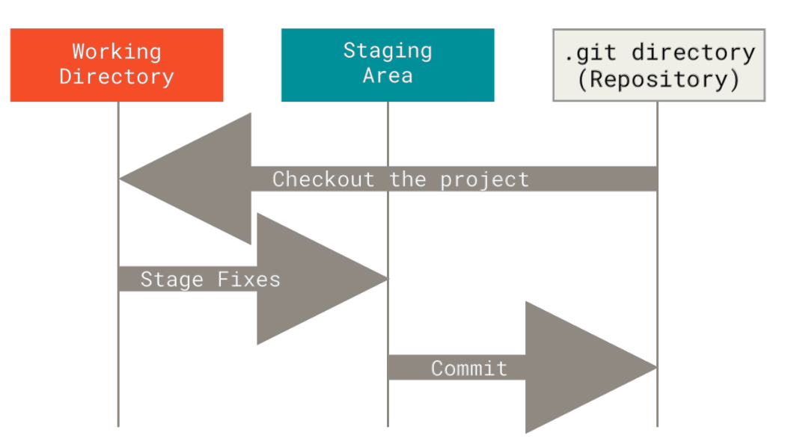

基本的 Git 工作流程如下：

1. 在工作区中修改文件（**modified**）
2. 将你想要下次提交的更改选择性地暂存，这样只会将更改的部分添加到暂存区（**staged**：git add）
3. 提交更新，找到暂存区的文件，将快照永久性存储到 Git 目录（**committed**：git commit）

# 初次运行 Git 前的配置  

## 设置用户信息

安装完 Git 之后，要做的第一件事就是设置用户名和邮件地址。因为每一次 Git 提交都会使用这些信息，它们会写入到你的每一次提交中，不可更改：  

> git config --global user.name "John Doe"
> git config --global user.email johndoe@example.com  

✨：如果使用了 **`--global`** 选项，表示你这台机器上所有的Git仓库都会使用这个配置

如果想针对特定项目使用不同的用户名称与邮件地址时，可以在那个项目目录下运行没有 --global 选项的命令来配置  

### 查看用户信息

> git config --global user.name 
> git config --global user.email  

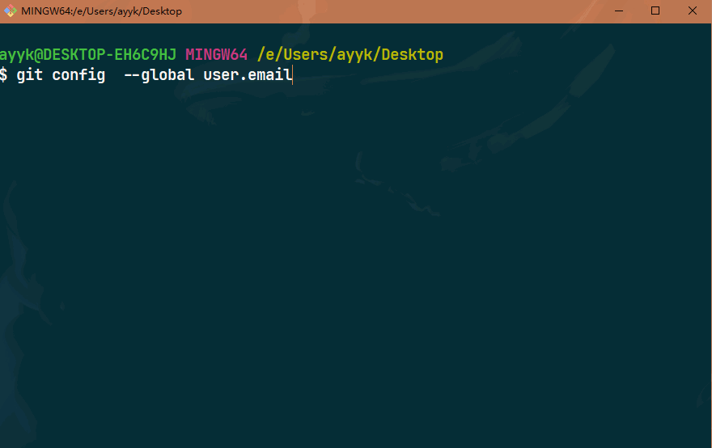

## 设置文本编辑器

> $ git config --global core.editor “”  

*在 Windows 系统上，如果你想要使用别的文本编辑器，那么必须指定可执行文件的完整路径*

> $ git config --global core.editor “'E:/SublimeText/sublime_text.exe' --replace-all”

### 检查配置

如果想要检查你的配置，可以使用 `git config --list` 命令来列出所有 Git 当前能找到的配置  

## 创建版本库

通常有两种创建 Git 项目仓库的方式：

- 将尚未进行版本控制的本地目录转换为 Git 仓库

- 从其它服务器 克隆 一个已存在的 Git 仓库

    *两种方式都会在你的本地机器上得到一个工作就绪的 Git 仓库*

### 本地目录

  **如果你有一个尚未进行版本控制的项目目录，想要用 Git 来控制它，那么首先需要进入该项目目录中**

  在 Windows 上：也可以直接进入该文件夹位置，然后右键Git Bash Here，在当前文件夹打开Git Bash，之后执行：

  > $ git init  

  该命令将创建一个名为 .git 的子目录，这个子目录含有你初始化的 Git 仓库中所有的必须文件。 

  **如果在一个已存在文件的文件夹（而非空文件夹）中进行版本控制，你应该开始追踪这些文件并进行初始提交。可以通过 `git add` 命令来指定所需的文件来进行追踪，然后执行 `git commit`**  

  >  git add readme.txt
  >  $ git commit -m 'wrote a readme file'  


### 克隆现有的仓库  

  克隆仓库的命令是 `git clone <url>` 。 比如，要克隆 Git 的链接库 `libgit2`，可以用下面的命令：  

  > $ git clone https://github.com/libgit2/libgit2  

  如果你想在克隆远程仓库的时候，自定义本地仓库的名字，你可以通过额外的参数指定新的目录名：  

  > $ git clone https://github.com/libgit2/libgit2 mylibgit  

  这会执行与上一条命令相同的操作，但目标目录名变为了 `mylibgit`  


# 文件状态  

工作目录下的每一个文件都不外乎这两种状态：**已跟踪** 或 **未跟踪**  

- `已跟踪`：指那些被纳入了版本控制的文件，在上一次快照中有它们的记录，在工作一段时间后， 它们的状态可能是：

    - 未修改
    - 已修改（**modified**）
    - 已暂存（**staged**）

    简而言之，已跟踪的文件就是 Git 已经知道的文件。 

- `未跟踪`：工作目录中除已跟踪文件外的其它所有文件都属于未跟踪文件，它们既不存在于上次快照的记录中，也没有被放入暂存区。 

    初次克隆某个仓库的时候，工作目录中的所有文件都属于已跟踪文件，并处于未修改状态，因为 Git刚刚检出了它们， 而你尚未编辑过它们。  

    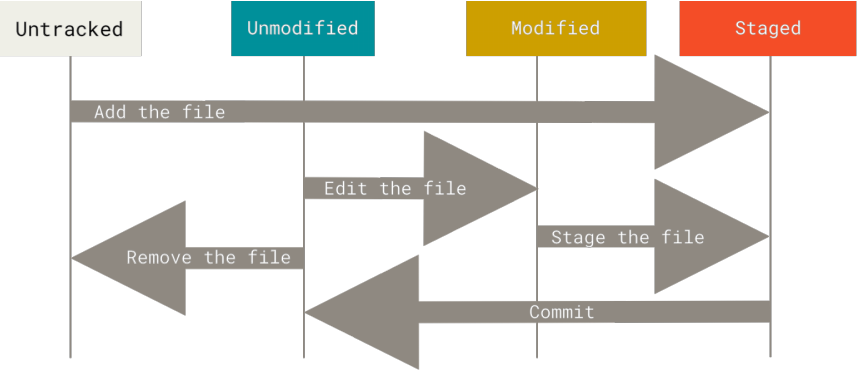

## 获取文件状态

可以用 `git status` 命令查看哪些文件处于什么状态。 如果在克隆仓库后立即使用此命令，会看到类似这样的输出  

> $ git status
> On branch master
> Your branch is up-to-date with 'origin/master'.
> nothing to commit, working directory clean  

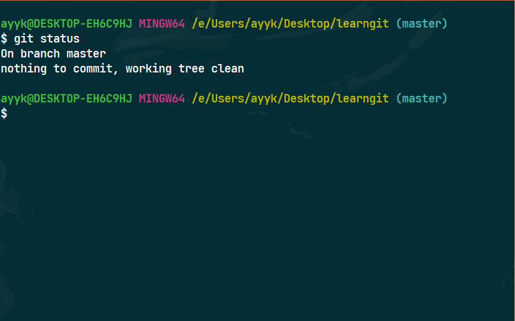

### 跟踪新文件  

使用命令 `git add` 开始跟踪一个文件。 所以，要跟踪 `README.txt` 文件，运行：  

> $ git add README.txt

注：

-  `Changes to be committed` ：说明文件是已暂存状态
-   出现在 `Changes not staged for commit` ：说明已跟踪文件的内容发生了变化，但还没有放到暂存区。  要暂存这次更新，需要运行 `git add` 命令


`git add` 命令，还能用于合并时把有冲突的文件标记为已解决状态等。   

### 状态简览  

`git status` 命令的输出十分详细，但其用语有些繁琐。使用 `git status -s` 命令缩短状态命令的输出 

- `??`   ：新添加的未跟踪文件  
- `A`    ：新添加到暂存区中的文件  
- `M`    ：修改过的文件  
- `MM`  ：文件暂存后又作了修改  

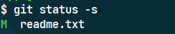

### 比较文件  

`git diff` 命令比较的是**暂存区**和**工作区**中文件的差异

```markdown
暂存区：
Git is a version control system.
Git is free software.
```

```markdown
工作区：
Git is a distributed version control system.
Git is free software.
```

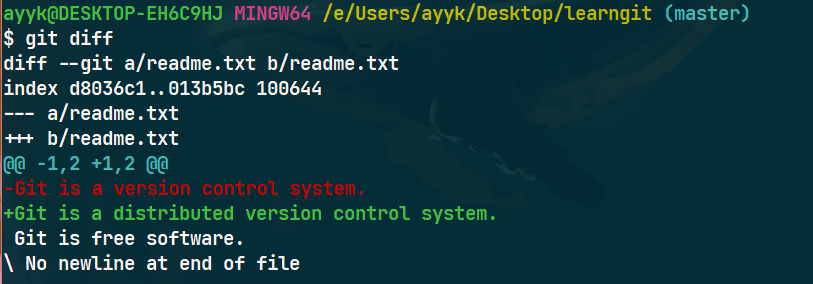

`git diff --staged`命令比较的是**暂存区**和最后一次提交到**Git库**中文件的差异

### 忽略文件

可以创建一个名为 `.gitignore` 的文件，列出要忽略的文件的模式  。

# 提交更新  

每次准备提交前，先用 `git status` 看下，所需要的文件是不是都已暂存起来了， 然后再运行提交命令`git commit`：  

> $ git commit -v 

注：更详细的内容提示可以用  `-v` :将你所做的更改 diff 输出呈现在编辑器中

> $ git commit  -m 提交信息

可以在 commit 命令后添加 `-m` 选项，将提交信息与命令放在同一行  

> $ git commit -a

Git会自动把所有已经跟踪过的文件暂存起来一并提交，跳过 `git add` 步骤。

# 移除文件  

- 使用 `git rm` 命令

    - `git rm -f`：删除之前修改过或已经放到暂存区的文件（工作目录中的文件被删除）
    - `git rm --cached`：从暂存区域移除，但仍然希望保留在当前工作目录中（文件不在被跟踪）

# 删除文件

> $ rm a.txt

删除 a.txt 文件

## 复原文件

找回被删除的文件，并恢复到最新版本（*会丢失最近一次提交后你修改的内容*）。

> $ git checkout

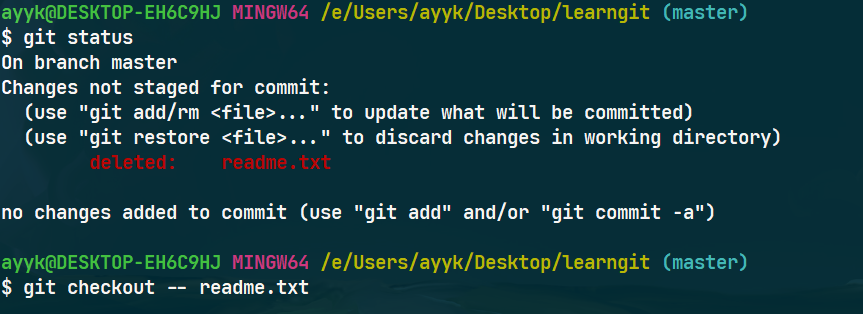

`git checkout`其实是用版本库里的版本替换工作区的版本，无论工作区是修改还是删除，都可以“一键还原”。

🎊注意：*从来没有被添加到版本库就被删除的文件，是无法恢复的！*

# 查看提交历史记录  

回顾提交历史，完成这个任务最简单而又有效的工具是 `git log` 命令 ，从上到下显⽰**最近**到**最远**的提交记录  。

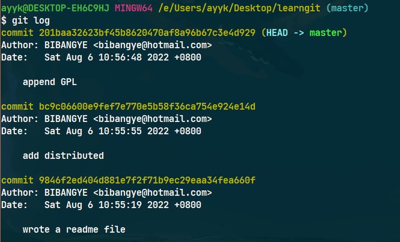

`git log` 的常用选项  ：

| 选项            | 说明                                                         |
| --------------- | ------------------------------------------------------------ |
| -p              | 按补丁格式显示每个提交引入的差异。                           |
| --stat          | 显示每次提交的文件修改统计信息。                             |
| --shortstat     | 只显示 --stat 中最后的行数修改添加移除统计。                 |
| --name-only     | 仅在提交信息后显示已修改的文件清单。                         |
| --name-status   | 显示新增、修改、删除的文件清单。                             |
| --abbrev-commit | 仅显示 SHA-1 校验和所有 40 个字符中的前几个字符。            |
| --relative-date | 使用较短的相对时间而不是完整格式显示日期（比如“2 weeks ago”）。 |
| --graph         | 在日志旁以 ASCII 图形显示分支与合并历史。                    |
| --pretty        | 使用其他格式显示历史提交信息。可用的选项包括 oneline、short、full、fuller 和 format（用来定义自己的格式）。 |
| --oneline       | --pretty=oneline --abbrev-commit 合用的简写                  |

限制 `git log` 输出的选项  

| -<n>              | 仅显示最近的 n 条提交。                    |
| ----------------- | ------------------------------------------ |
| --since, --after  | 仅显示指定时间之后的提交。                 |
| --until, --before | 仅显示指定时间之前的提交。                 |
| --author          | 仅显示作者匹配指定字符串的提交。           |
| --committer       | 仅显示提交者匹配指定字符串的提交。         |
| --grep            | 仅显示提交说明中包含指定字符串的提交。     |
| -S                | 仅显示添加或删除内容匹配指定字符串的提交。 |

# 回退版本

在Git中，用`HEAD`表示当前版本。上一个版本就是`HEAD^`，上上一个版本就是`HEAD^^`，往上100个版本写100个`^`比较容易数不过来，所以写成`HEAD~100`。

退回到上一个版本

> git reset --hard  head^

退回到上上个版本

> git reset --hard  head^^

退回到第x个版本

> git reset --hard  head~x

显示历史操作记录

> $ git reflog  

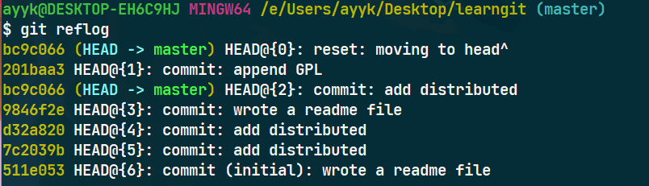

根据 commit id 回到之前的某个版本

> git reset --hard  commit-id

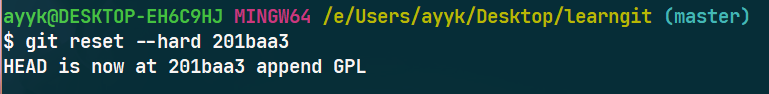

# 撤销修改

> $ git restore  a.txt

命令git restore  a.txt意思就是把 a.txt文件在工作区的修改全部撤销，这里有两种情况：  

- 修改后还没有被放到暂存区，撤销修改就回到和版本库中文件一模⼀样的状态  
- 已经添加到暂存区后，又作了修改，撤销修改就回到暂存区中文件的状态  

*本地版本库推送到远程版本库后，无法修改。*

# 重新提交

提交完了才发现漏掉了几个文件没有添加，或者提交信息写错了  

> $ git commit --amend  

这个命令会将暂存区中的文件提交。 如果在上次提交后马上执行了此命令， 那么快照会保持不变，而所修改的只是提交信息。
文本编辑器启动后，可以看到之前的提交信息。 编辑后保存会覆盖原来的提交信息。  （最终你只会有一个提交——第二次提交将代替第一次提交的结果  ） 

# 关联远程仓库

`git remote add <shortname> <url>`   添加一个新的远程 Git 仓库，同时指定一个方便使用的简写

- **shortname**：远程仓库简写，远程库的名字就是`origin`
- **url**：远程仓库地址

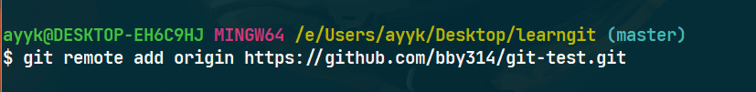

`git remote -v`会显示需要读写远程仓库使用的 Git 保存的简写与其对应的 URL  

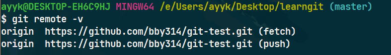

## 推送到远程仓库  

用`git push`命令，是把当前分支`master`推送到远程。

> `git push <shortname> <branch>`  

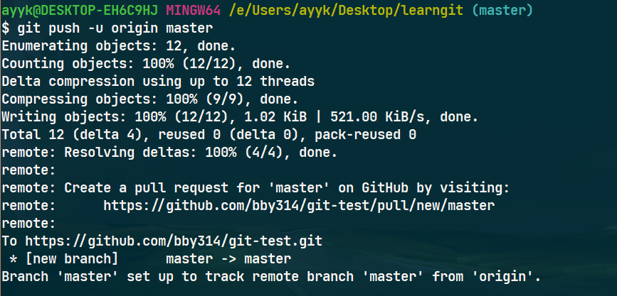

由于远程库是空的，第一次推送`master`分支时，加上了`-u`参数，Git不但会把本地的`master`分支内容推送的远程新的`master`分支，还会把本地的`master`分支和远程的`master`分支关联起来，在以后的推送或者拉取时就可以简化命令。

*github使用的主分支为 `main`*

## 从远程仓库中拉取 

从远程仓库中拉取所有你本地还没有的数据。 执行完成后，你将会拥有那个远程仓库中所有分支的引用，可以随时合并或查看   

> `git fetch <shortname>`  

## 查看远程仓库信息  

> `git remote -v <shortname>`   

## 远程仓库的重命名与删除 

### 重命名

> `git remote <shortname-old> <shortname-new>`  

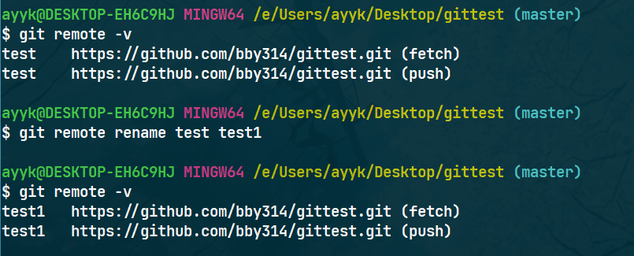

### 删除远程仓库

解除了本地和远程的绑定关系，并不是物理上删除了远程库。远程库本身并没有任何改动。

> `git remote rm <shortname>`

# 分支管理

## 创建新分支

- 创建并切换到新分支  

> `git checkout -b <branch-name>`

- 仅**创建** 一个新分支

> `git branch  <branch-name>`

## 分支切换

> `git checkout <branch-name>`

---

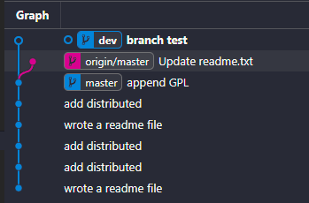

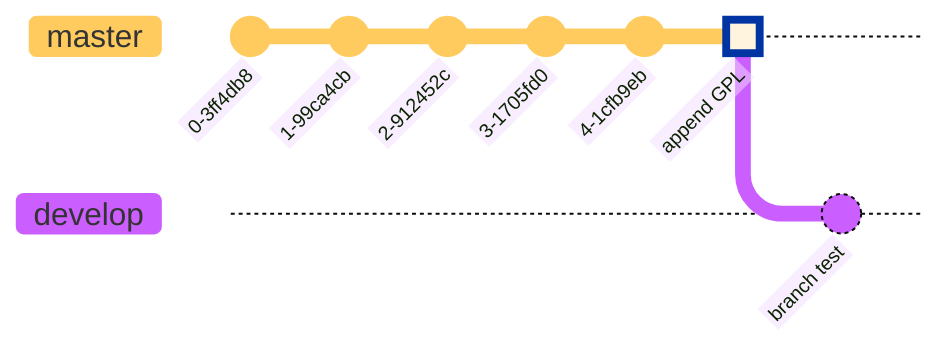

## 合并分支

将其它分支合并到当前分支

> `git merge <branch-name>`

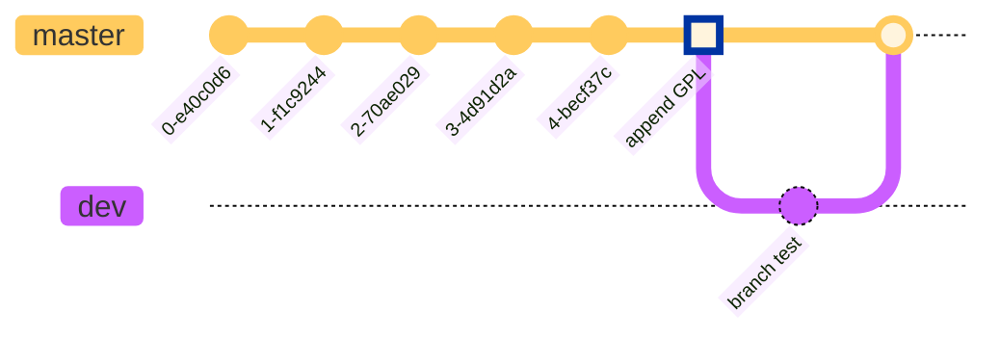

## 删除分支

> `git branch -d <name>`

## 查看当前分支

`git branch`命令会列出所有分支，当前分支前面会标一个`*`号。

> `git branch`

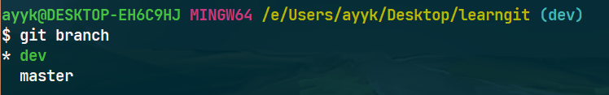

# 标签管理 

Git 可以给仓库历史中的某一个提交打上标签，以示重要。 比较有代表性的是人们会使用这个功能来标记发布结点（ v1.0 、 v2.0 等等）。

##   创建标签

- 轻量标签（lightweight）  ：不会改变的分支——它只是某个特定提交的引用  

> `git tag <tag name>`

- 附注标签（annotated）  ：存储在 Git 数据库中的一个完整对象， 它们是可以被校验的，其中包含打标签者的名字、电子邮件地址、日期时间  

> `git tag -a v1.4 -m "my version 1.4"`  

***-a** 选项指定标签名* 

***-m** 选项指定了一条将会存储在标签中的信息*  

### 根据 commit id 创建标签

> `git tag <tag name>  <commit id>`

## 删除标签

- **标签未推送到远程**

因为创建的标签都只存储在本地，不会自动推送到远程。所以，打错的标签可以在本地安全删除。

> `git tag -d <tag name>`

- **标签已经推送到远程**

1. 先删除本地标签

> `git tag -d <tag name>`

2. 再删除远程标签

> `git push origin :refs/tags/<tag name>`

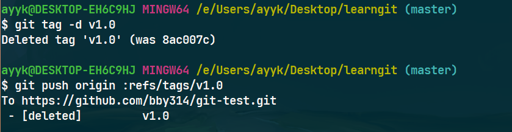

## 推送某个标签到远程

> `git push origin <tag name>`

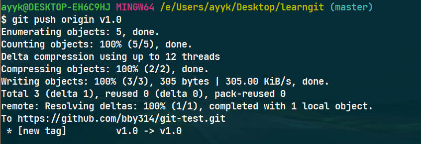

- 一次性推送全部尚未推送到远程的本地标签

    > `git push origin --tags`

## 标签信息

*标签不是按时间顺序列出，而是按字母排序的。*

### 显示所有标签

> `git tag`

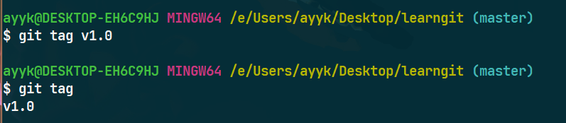

### 查看标签信息

> `git show <tag name>`

🧨注意：*标签总是和某个commit挂钩。如果这个commit既出现在master分支，又出现在其它分支，那么在这两个分支上都可以看到这个标签。*

# git美化

## 修改配置文件

如果你安装的有 VS Code，就可以直接 `code ~/.minttyrc` 打开配置文件，将下列代码复制粘贴进去。字体使用`JetBrains Mono` 字体。

```
Font=Jetbrains Mono
FontHeight=14
Transparency=low
FontSmoothing=full
Locale=zh_CN
Charset=UTF-8
Columns=88
Rows=26
OpaqueWhenFocused=no
Scrollbar=none
Language=zh_CN

ForegroundColour=255,255,255
BackgroundColour=0,43,54
CursorColour=220,130,71

BoldBlack=128,128,128
Green=64,200,64
BoldGreen=64,255,64
Yellow=190,190,0
BoldYellow=255,255,64
Blue=135,144,255
BoldBlue=30,144,255
Magenta=211,54,130
BoldMagenta=255,128,255
Cyan=64,190,190
BoldCyan=128,255,255
White=250,240,230
BoldWhite=250,240,230

BellTaskbar=no
Term=xterm-256color
FontWeight=400
FontIsBold=no
BellType=0

CtrlShiftShortcuts=yes
ConfirmExit=no
AllowBlinking=yes
BoldAsFont=no
```


